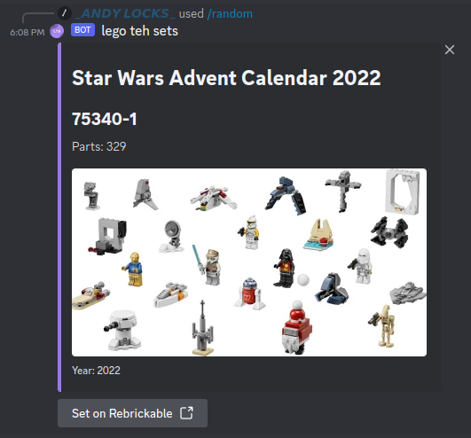

# Lego Teh Set

[](https://github.com/AndyLocks/LegoTehSet/blob/master/LICENSE)
[]()
[](https://github.com/discord-jda/JDA)
[](https://rebrickable.com/api/)

[](https://discord.com/oauth2/authorize?client_id=1015539392393252924)
<p align="center"></p>

***<p align="center">A bot that will help you find lego sets directly in discord chat</p>***

<p align="center"></p>

## Description

This bot automates the search and speeds it up. Using one command, you can request several Lego sets at once directly in the discord chat.

## Commands
- **search** - show all found sets by request

  

  There are arrows for scrolling:

  

  The page button helps you enter the desired page:

  

  There is also a sorting option:

  

- **random** - get random set

  

  It is possible to choose the theme of the set:

  

- **favourites** - show my favourite sets

  

  Same control buttons as in the `search` command.

- **add_favourite** - mark a set as a favourite

  

## Lego API

[Rebrickable](https://rebrickable.com/api/)
> Rebrickable provides a number of API/Web Services to assist developers build their own websites or apps which use the Rebrickable database.

## Invite the bot

<a href="https://discord.com/oauth2/authorize?client_id=1015539392393252924">Authorization</a>

## Build

How to run a bot locally on your computer

### Clone this repository

```bash
git clone https://github.com/AndyLocks/LegoTehSet
```

### Configuration

1. Rename `.env.example` to `.env`
2. Write a discord bot token in the `TOKEN` column

   Example: `TOKEN=asSkDSfjwDebt.AbobAkdkjdOnbwdslkfjwelkhfgnkoAJSsdDasdWdHKPjsdkfhn.LKDSJlksdflkjDFlksdjf`
3. Write a [Rebrickable api](https://rebrickable.com/api/) token in the `REBRICKABLE_API_KEY` column

### Install docker and docker compose

Here you can read how to install [Docker compose](https://docs.docker.com/compose/install/).

Here you can read how to install [Docker engine](https://docs.docker.com/engine/install/).

### Run project

```bash
docker compose up --build
```

## Architecture


### LTS

The basic microservice. Manages the bot logic, located in the `.` folder.

### Profile hub

Profile microservice. Saves users' favorite sets and adds new ones. Located in the `profile_hub` folder.
